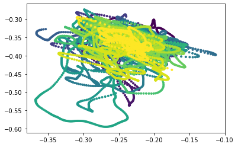
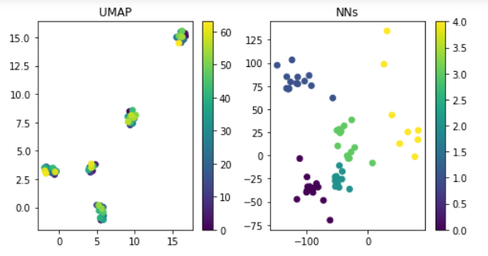

#  Vector Embeddings of Brain Dynamics
<!-- ALL-CONTRIBUTORS-BADGE:START - Do not remove or modify this section -->

<!-- ALL-CONTRIBUTORS-BADGE:END -->

tl;dr: This repo provided implementation of a siamise network for brain connectivity embeddings.

## Overview

Whereas we can build time-varying functional connectivity (TVFC) graphs easily and efficiently using instantaneous wavelet coherence. And whereas we can compare TVFC graphs using a host of graph-graph metrics---from simple edge-wise overlap, to more robust methods from topological data analysis. The capacity to understand how TVFC states compare among volunteers is limited by the transductive nature of state-of-the-art manifold embedding algorithms such as tSNE and UMAP. Transductive methods tend to overweight the temporal adjacencies of graph-graph distances measured within single volunteers, and thereby ignore the large-scale graph-graph similarities measured across volunteers.

## Solution

To address this issue, this project aims to build vector embeddings of several matrices of TVFC graph-graph distances. One class of inductive and vectorized embedding that may work well is the Siamese neural network. We provide here a simple `tensorflow.keras` implementation.

## Examples

## Contributors ✨

Thanks goes to these wonderful people ([emoji key](https://allcontributors.org/docs/en/emoji-key)):

<!-- ALL-CONTRIBUTORS-LIST:START - Do not remove or modify this section -->
<!-- prettier-ignore-start -->
<!-- markdownlint-disable -->
<table>
  <tr>
    <td align="center"><a href="https://github.com/dokato"> <b>dokato</b></a> <a href="https://github.com/dokato/brain-embeddings/commits?author=dokato" title="Code">💻</a> <a href="#design-dokato" title="Design">🎨</a> <a href="#content-dokato" title="Content">🖋</a> <a href="#ideas-dokato" title="Ideas, Planning, & Feedback">🤔</a> <a href="#tool-dokato" title="Tools">🔧</a></td>
    <td align="center"><a href="https://github.com/JacobCWBillings"> <b>Jacob Billings</b></a> <a href="https://github.com/dokato/brain-embeddings/commits?author=JacobCWBillings" title="Code">💻</a> <a href="#design-JacobCWBillings" title="Design">🎨</a> <a href="#content-JacobCWBillings" title="Content">🖋</a> <a href="#ideas-JacobCWBillings" title="Ideas, Planning, & Feedback">🤔</a> <a href="#tool-JacobCWBillings" title="Tools">🔧</a></td>
  </tr>
</table>

<!-- markdownlint-enable -->
<!-- prettier-ignore-end -->
<!-- ALL-CONTRIBUTORS-LIST:END -->

This project follows the [all-contributors](https://github.com/all-contributors/all-contributors) specification. Contributions of any kind welcome!